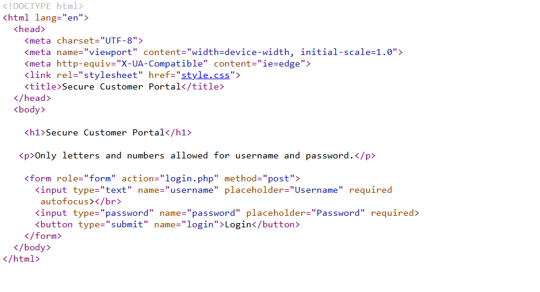

# 📌 Local Authority – picoCTF 2022

## 🧠 Challenge Info
- **Category**: Web Exploitation  
- **Description**:  
  > Can you get the flag? Go to this [[website](https://play.picoctf.org/practice/challenge/278)](#) and see what you can discover.

---

## 🛠️ Solution – Step by Step

### 1. Opening the Challenge Page  
I clicked the link provided in the challenge, which opened a basic login form.  


---

### 2. Inspecting the Source Code  
I used `Ctrl + U` to view the page source.  
There, I found the login form pointing to `login.php` and noticed that it uses a script file named `secure.js` for password verification.  


---

### 3. Opening `secure.js`  
I navigated to `secure.js` via the browser’s developer tools.  
Inside it, I discovered a JavaScript function called `checkPassword` which verifies credentials against hardcoded values:
```js
function checkPassword(username, password)
{
  if( username === 'admin' && password === 'strongPassword098765' )
  {
    return true;
  }
  else
  {
    return false;
  }
}
```


---

### 4. Logging in with Discovered Credentials  
I returned to the login form and entered the credentials I found:  
- Username: `admin`  
- Password: `strongPassword098765`  
After submitting the form, I was redirected to a page that displayed the flag.  


---

### 5. Flag Discovered 🎉  
The flag appeared clearly on the restricted page.  
```txt
picoCTF{th1s_1s_th3_fl4g}
```


---

## 📚 What I Learned  
- How to inspect external JavaScript files.  
- How to reveal hardcoded credentials in client-side logic.  
- How to use browser tools to understand frontend behavior and bypass login systems.
